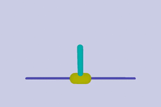
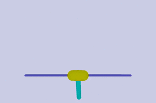
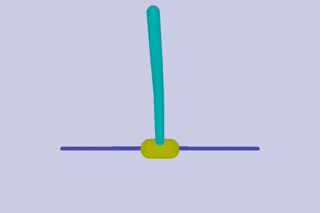
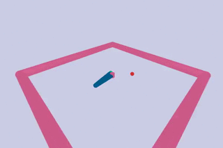
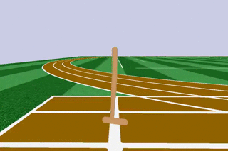
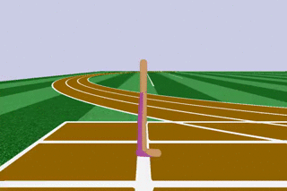
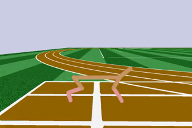
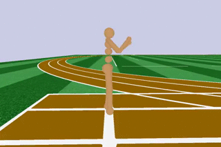
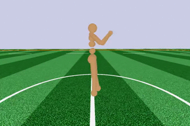
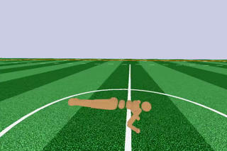

# Chapter 9: Exploring the Learning Environments Landscape

## [Roboschool](https://github.com/openai/roboschool)

To setup Roboschool in the `rl_gym_book` conda environment, follow the steps below:

1. Activate the `rl_gym_book` conda environment: `source activate rl_gym_book`
2. Navigate to this (`ch9`) folder and run the `setup_roboschool.sh` script: 
   1. `cd ch9`
   2. `chmod a+x ./setup_roboschool.sh`
   3. `./setup_roboschool.sh`
3. Follow the output from the script to make sure the installation is successful.
You can run a demo using the following command:

   `(rl_gym_book) praveen@ubuntu:~/HOIAWOG/ch9$ python ~/software/roboschool/agent_zoo/
demo_race2.py`
  
**Note**:
If you get an error like below when you launch the demo script or when you try to use a Roboschool environment:

```bash
QGLShaderProgram: could not create shader program
bool QGLShaderPrivate::create(): Could not create shader of type 2.
python: render-simple.cpp:250: void SimpleRender::Context::initGL(): Assertion `r0' failed.
```

Then, add the following line at the top of the demo script or to your script which are are trying to run:
`from OpenGL import GLU`

The available Roboschool environments along with their observation and action spaces are summarized in the table
below for quick references:

|Env ID | Roboschool env | obs space | action space|
|---------------------|------|-----|--------|
|RoboschoolInvertedPendulum-v1||Box(5,)|Box(1,)| 
|RoboschoolInvertedPendulumSwingup-v1||Box(5,)|Box(1,)| 
|RoboschoolInvertedDoublePendulum-v1| |Box(9,)|Box(1,)| 
|RoboschoolReacher-v1| |Box(9,)|Box(2,)| 
|RoboschoolHopper-v1| |Box(15,)|Box(3,)| 
|RoboschoolWalker2d-v1| |Box(22,)|Box(6,)| 
|RoboschoolHalfCheetah-v1| |Box(26,)|Box(6,)| 
|RoboschoolAnt-v1| |Box(28,)|Box(8,)| 
|RoboschoolHumanoid-v1| |Box(44,)|Box(17,)| 
|RoboschoolHumanoidFlagrun-v1||Box(44,)|Box(17,)| 
|RoboschoolHumanoidFlagrunHarder-v1||Box(44,)|Box(17,)| 
|RoboschoolPong-v1||Box(13,)|Box(2,)| 
